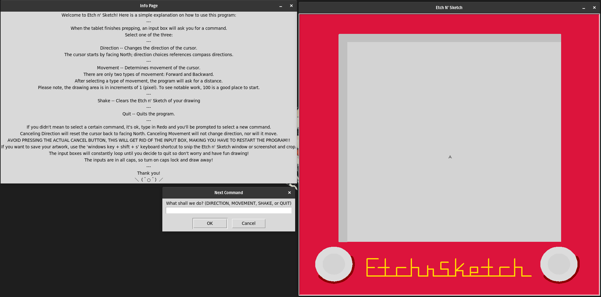

# Etch n Sketch

This application was an aimed to replicate the use of an etch n sketch.

# Table of contents

0. [Main README](/README.md)
1. [Dependencies](#dependencies)
2. [Screenshots](#screenshots)
3. [Run Locally](#run-locally)
4. [Usage](#usage)
5. [License](#license)

## Dependencies

[**TKinter**](https://docs.python.org/3/library/tkinter.html) - A Python library that can be used to construct basic graphical user interface (GUI) applications

[**Turtle Graphics**](https://docs.python.org/3/library/turtle.html) - A Python library used for geometric drawing

## Screenshots



## Run Locally

Clone the project

```bash
  git clone https://link-to-project
```

Go to the project directory

```bash
  cd my-project
```

Install dependencies

```bash
npm install
```

Start the server

```bash
npm run start
```

## Usage

## License

This application falls under the same license as the repository that it is contained in.

[LGPL 3.0](https://choosealicense.com/licenses/lgpl-3.0/)
